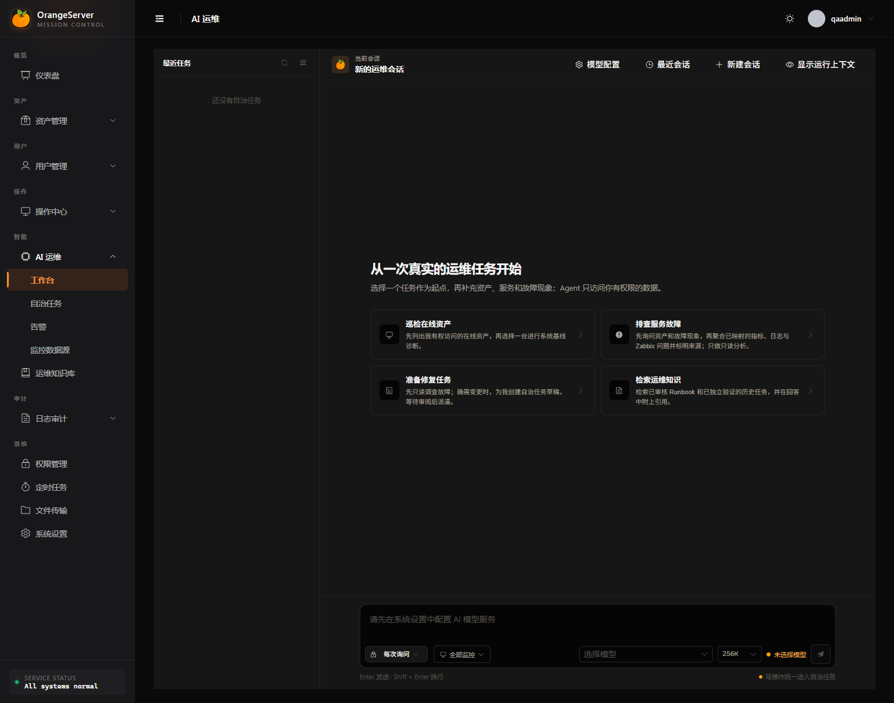

# AI 运维使用指南

OrangeServer AI 运维是权限受控的自然语言入口。聊天适合查询平台中的结构化数据，
以及准备需要用户审批的批量命令；聊天不会获得任意数据库、SSH 或 Shell 权限。
单资产受控自治在独立工作台 `/ai-runs` 中提供；标准 bundled 安装默认启用，见下文。

## 使用前准备

管理员需要先完成 [Provider 配置](PROVIDER_AND_CONTEXT.md)。普通用户还需要：

- 对目标资产或资产组有访问权限；
- 对所选系统用户有使用权限；
- 对相应平台功能有角色权限。

AI 不会绕过现有授权。管理员专用的账号和审计查询工具不会提供给普通用户。

## 当前可用能力

| 场景 | 行为 |
|---|---|
| 平台概览 | 查询权限范围内的资产和基础统计 |
| 资产查询 | 按名称、IP、分组和状态筛选已授权资产 |
| 定时任务查询 | 查询当前用户可见的任务 |
| 系统用户查询 | 列出可用于目标资产的系统用户 |
| 账号与审计查询 | 仅管理员可用 |
| 只读主机诊断 | 运行服务端固定 Linux/Docker 探针并生成证据化规则报告 |
| 批量命令准备 | 创建待审批动作，不会立即执行 |

只读主机诊断不是开放式 Shell。模型只能选择固定档案、已查询资产结果集、已授权
系统用户和结构化参数。详见 [受控只读诊断](DIAGNOSTICS.md)。



## 查询与结果集

查询工具会把完整结果保存在服务端，并返回 `result_set_id`。界面通常只显示样例
和数量，但后续批量操作使用的是服务端保存的完整资源 ID 集合。

- 不要手工构造或修改 `result_set_id`。
- 需要改变范围时，重新描述筛选条件，让 Agent 再次查询。
- 结果集按当前用户隔离，并随会话过期。

示例：

```text
列出我能访问的在线资产，按资产组汇总，并给出前 5 个名称。
```

## 准备和审批批量命令

推荐在一次请求中说清目标、命令、系统用户和原因：

```text
对刚才查询结果中的资产，用“只读运维账号”执行 df -h，
原因是“例行磁盘容量检查”。先生成计划，不要执行。
```

Agent 只创建待审批动作。执行卡会展示命令、目标数量、系统用户、原因、风险和
有效期。确认前应逐项检查，不清楚时取消动作。

点击确认后，后端会重新检查：

- 动作是否属于当前用户和当前会话；
- 动作是否仍在有效期内且未被处理；
- 当前用户是否仍有资产和系统用户权限；
- 目标数量是否在服务端上限内；
- 命令是否命中危险命令规则。

通过后才会复用批量 SSH 服务执行，并形成命令与操作审计。取消、拒绝、过期、
部分成功和全部失败都有独立状态。

## 运行只读诊断

先用资产查询得到不超过 10 台的 `result_set_id`，再描述要检查的方向，例如：

```text
对刚才查询出的机器，用“只读运维账号”运行磁盘和 inode 诊断，
展示逐资产进度、结论和证据。
```

系统只执行服务端内置命令，自动形成诊断卡。报告由确定性规则生成，Finding 必须
引用同一诊断 Run 的 Evidence ID。root 系统用户可以选择，但会显示持续的高权限
风险提示；生产环境应优先使用低权限只读账号。

证据来自远端主机，始终按不可信数据处理。不要把命令输出中的文字当作系统指令。
诊断报告提出的 Runbook 是建议，不会自动修改主机。


## 运维态势与告警入口

管理员打开 AI 运维页时，会先看到待处理告警、活动任务、最近结论、Worker 并发槽和
知识索引状态；聊天仍保留在下方，用于查询、解释、诊断和创建自治任务草稿。

配置 Alertmanager 机器入口后，单条 `firing` 告警会按 `groupKey + startsAt` 幂等创建
并启动一个 `ask` Run。Webhook 标签只引用服务端已有资产和系统凭据，不能提供用户、
凭据内容、URL、Header 或 PromQL。可选的 Prometheus 观察固定查询该服务最近 15 分钟
的可用性，结果以脱敏 Evidence/Artifact 进入同一 Run 时间线。

`resolved` 通知只追加一条告警恢复观察，不能替代 Worker 的独立验证，也不会把 Run
直接标为已解决。任何写动作仍必须经过原有服务端策略与 `ask` 审批。

## 自治任务工作台

启用 M1 自治功能后，管理员可以在 `/ai-runs` 创建和查看单资产自治任务，
并在 `/ai-runs/:runId` 查看服务端权威的计划、执行、审批、证据、验证和结论。
标准 bundled 安装会启动统一 Redis 8 与 Worker，自治任务默认可用。
基础设施未就绪时服务端会阻止启动。

开始前确认：管理员账号、已通过 Tool Calling 测试的 Provider、一个明确标记为
`production`、`staging` 或 `lab` 的测试资产、已授权系统用户，以及与生产统一 Redis
分离的自治 Redis 8。`auto` 模式只允许 `lab` 资产；`ask`、`ai_review` 和 `custom`
仍受服务端动作白名单、审批规则、预算和永久拒绝清单约束。

聊天仍然只是入口：聊天可以创建指向自治任务的草稿引用卡，但不能直接启动、
审批或取消 Run。创建草稿时，资产、系统凭据、执行模式和预算由服务端固定，
模型不能在运行中替换这些边界。同一资产最多保留一个活动自治 Run。

工作台支持四种服务端权限模式：

- `ask`：每个写入动作都暂停，等待管理员批准；
- `ai_review`：由独立 Guardian 审查可审查动作，无法审查或高风险时转人工；
- `auto`：仅对管理员标记为 `lab` 的资产，在服务端预算和权限范围内自动执行；
- `custom`：使用管理员预先组合的固定动作类别和目标范围。

列表支持按目标、资产、凭据或 Run ID 搜索；每行提供明确的“查看详情”入口，
并同时显示相对时间和最近动态的完整时间。新建草稿时，四种模式都会直接显示
适用场景和审批含义；预算、轮次和输出限制默认使用服务端值，需要时再展开高级限制。
详情页以计划步骤为主，证据、产物和审计事件按需展开，避免把原始字段堆在首屏。

运行中的固定阶段是“提议 → 执行 → 审批（必要时）→ 验证 → 结论 → 终结”。
远端输出会按不可信证据处理，经过清理、脱敏和限长后才进入 Artifact；独立验证
只引用本次 Run 的 Evidence。最终结果使用“成功 / 无法判定 / 失败”三态，证据不足
或模型给出不完整结论时不会被报告为成功。

DeepSeek 等 OpenAI-compatible 模型的 Tool Calling 阶段或参数出现偏差时，服务端
最多执行一次指定工具的协议修复；结论引用只能使用服务端生成的同一 Run Evidence
ID。修复后仍无法形成合法引用时，如果已有独立验证，服务端会安全收口为“无法判定”，
不会重放任何写动作。

## 如何理解自治任务的执行结果

在 `/ai-runs/:runId` 详情页先看“本次结论”，再看步骤和证据：

- **目标已完成**：服务端结论为 `resolved`，页面同时显示成功步骤数和独立验证通过数；
- **目标未完成**：服务端结论为 `not_resolved`，至少有动作失败或目标仍未满足；
- **证据不足，无法判定**：服务端不能确认目标是否达成，不能把它当作成功；
- **任务尚未形成结论**：Run 仍在执行、审批、恢复或等待终态。

每个计划步骤都按以下顺序阅读：

1. **执行动作**：页面先显示人类可读的动作和目标，例如“检查磁盘使用率”或“重启系统服务”，
   并保留服务端生成的动作摘要；
2. **命令结果**：显示执行成功/失败、退出码，或“结果未知”。结果未知不得视为成功；
3. **结果证据**：点击“命令标准输出”“命令错误输出”“文件变更差异”等按钮，按需打开本步骤
   的单条 Artifact 正文。正文仍受清理、脱敏、限长和加密保留规则约束。

右侧的“动作结果 / 验证结果”是 Evidence 索引，不是另一份结论。它会链接回同一 Run 的结果
Artifact；原始 Evidence 摘要、动作摘要和 digest 收在“查看原始审计字段”中，供排查和审计时展开。
因此，先看结论和步骤结果，只有需要追溯时再展开原始字段。

对话中的后续追问会读取最新 Run 的权威状态，而不是沿用创建计划时“待审批”的旧描述。
远端输出可能被截断；执行卡、结果接口和审计日志才是追溯执行事实的稳定入口。

## 会话与上下文

- 每个用户最多保留 20 个最近会话。
- 会话、结果集和关联状态默认在 Redis 保存 7 天，不是永久知识库。
- 待审批动作默认 10 分钟过期。
- 新会话创建时固定 Provider、模型和上下文档位。
- 256K 是默认档；1M 只对明确声明支持的 Provider 开放。
- 接近上下文预算时，会压缩早期已完成轮次并保留最近轮次和权威状态。

不要在对话里粘贴密码、私钥、Token、数据库连接串或未脱敏日志。Provider 可能
是第三方服务，发送给模型的内容受对应厂商条款约束。

## 当前安全限制

- Provider Base URL 默认不能解析到环回、链路本地或私网地址。
- API Key 只在后端解密，不通过配置接口返回。
- 固定诊断证据经过控制字符清理、常见秘密脱敏、限长和加密存储。
- 模型上下文不发送成功命令的完整输出、主机 IP/ID、内部结果 ID 或远端原始错误。
- 服务端会把失败原因归类后再提供给模型。
- AI 的回答不是审计事实；执行卡、结果接口和审计日志才是权威来源。

需要接入受控内网模型网关时，先阅读
[Provider 与上下文](PROVIDER_AND_CONTEXT.md) 和
[架构与信任边界](../architecture/TRUST_BOUNDARIES.md)。
