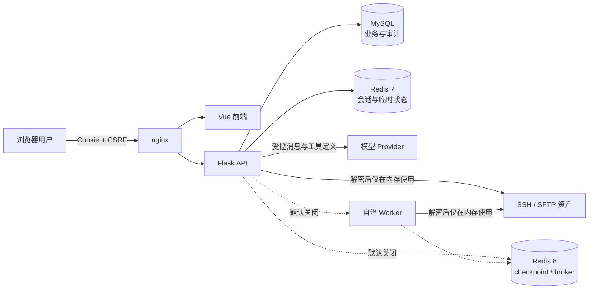
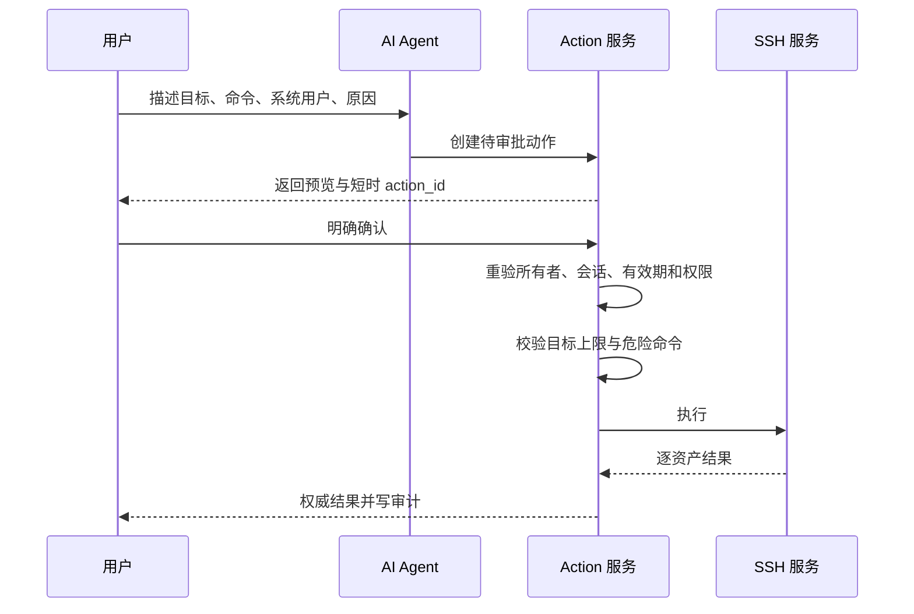

# 架构与信任边界

本文说明 OrangeServer 的主要数据流和安全责任。它不替代组织自身的网络、身份、
密钥和主机安全策略。

## 组件和数据职责

| 边界 | 可信输入 | 必须视为不可信 |
|---|---|---|
| 浏览器 → API | 服务端验证后的身份 | 请求参数、文件、Origin、用户粘贴内容 |
| API → MySQL/Redis | 服务端生成的键和结构 | 数据库中可能包含的历史/外部文本 |
| API / Worker → SSH 资产 | 已授权的凭据引用 | 远端输出、文件名、终端控制字符 |
| API → Provider | 固定系统提示和工具 schema | 用户文本、查询数据、模型输出、工具参数 |
| Provider → 执行 | 无直接信任 | 所有工具调用、计划提案和生成命令 |
| SSH 资产 → 诊断 / 自治 | 无直接信任 | 命令输出、日志、进程名和终端控制字符 |

## 身份与权限

- 浏览器通过同源 Cookie 会话访问 API，写请求需要 CSRF 校验。
- 后端角色分为管理员和普通用户；具体资产访问由授权关系继续收窄。
- SSH 凭据以系统用户记录保存，使用 Fernet 加密。
- 解密只发生在需要访问 Provider 或资产的服务端进程内。
- AI 工具每次调用都使用当前用户身份，不接受模型自报的用户、角色或权限。

## AI 查询边界

模型只看到服务端声明的工具。工具返回前先经过权限过滤，完整结果存为当前用户
隔离的 `result_set_id`。模型无法把样例行中的值扩展为新的资产范围。

普通用户不能调用账号和审计查询工具。模型输出只是解释层，不应作为授权和审计
依据。

## 只读诊断边界

诊断使用服务端固定的档案和命令。模型与浏览器只能选择 `profile_id`、已存在的
资产范围、系统用户和受 schema 约束的参数，不能提交 Shell。服务端再次检查全部
资产和系统用户权限，单次最多 10 台。

远端证据先清除控制字符、脱敏常见秘密并限长，再使用 Fernet 加密保存。所有证据
都标记为不可信，确定性 Finding 必须引用同一 Run 的 Evidence ID。模型上下文只
接收有限的结论和引用，不接收整段原始远端证据。

诊断档案是只读路径；任何修复仍需进入下面的 AI 动作边界。

## AI 动作边界

待审批动作默认 10 分钟过期。服务端使用锁避免重复执行；执行期间延长临时状态的
保存时间。危险命令规则是额外防线，不能把未命中规则的命令等同于安全命令。

## M1 受控自治边界

M1 自治默认关闭。标准发布栈只有业务 Redis 7；专用 Redis 8 和 Worker 只出现在
隔离开发/验收覆盖层。开启后仍遵守：

- 模型只提出动作；服务端用 `allow | ask | deny` 决定是否执行。`deny` 不能被模型、
  Guardian 或人工提升。
- 目标资产、系统用户、权限档案、预算和动作白名单在 Run 启动后锁定。
- `auto` 仅允许管理员标记为 `lab` 的资产；写动作执行前重新校验权限、凭据和环境。
- Worker 用一次性租约认领 Run。写结果未知时进入 `needs_attention`，不自动重放。
- Redis 8 只保存 checkpoint 和 Celery broker 数据，不是业务事实源。
- 远端输出按不可信 Evidence 处理：清理、脱敏、限长后加密保存。

启用命令和关闭条件见 [AI 运维使用指南](../ai/USER_GUIDE.md) 与
[部署手册](../../DEPLOY.md)。

## 秘密和敏感数据

禁止提交或公开：

- `.env`、Provider API Key、Fernet key、Flask secret；
- SSH 密码、私钥和数据库连接凭据；
- 真实内部主机地址、部署路径、镜像回滚名和网络拓扑；
- 未脱敏的日志、截图、命令输出和审计导出。

配置接口不会返回 Provider 明文密钥。对话提供给模型的动作上下文会移除成功
命令输出、主机 IP/ID、内部结果 ID 和原始远端错误；失败原因只提供有限分类。

## 数据保留

| 数据 | 默认位置 | 当前保留行为 |
|---|---|---|
| 资产、授权、系统用户、审计 | MySQL | 按业务表和管理员策略 |
| Web 会话、缓存 | Redis | 由各功能 TTL 控制 |
| AI 会话、结果集 | Redis | 7 天 |
| AI 待审批动作 | Redis 7 | 10 分钟；执行状态会适当延长 |
| AI 工具展示事件 | AI 会话 | 每个会话最多保留最近 200 条 |
| 诊断 Run、事件、加密证据、报告 | MySQL | 证据默认 7 天；报告、Run 与事件默认 90 天后级联删除，可配置 |
| 自治 Run、Step、Event | MySQL | 默认 90 天 |
| 自治 Artifact / Evidence | MySQL | Artifact 默认 7 天；Evidence 引用随 Run 保留 |
| 自治 checkpoint / Celery broker | Redis 8 | 仅隔离栈；不保存最终业务结果 |

Redis 中的 AI 对话不是永久事件存储。若组织需要长期留存，应以审计日志和外部
合规系统为准。

## 部署责任

生产管理员负责：

- 强制 HTTPS，设置正确的 `OGS_HTTPS` 和 CSRF 来源；
- 对 MySQL、业务 Redis 7、隔离自治 Redis 8 和应用网络分段并使用最小权限账号；
- 生产实例保持 `OGS_AI_AUTONOMY_ENABLED` 为空，除非经过独立授权的隔离验收；
- 保护并轮换 Fernet、会话和数据库密钥；
- 对 Provider 出口和私有模型网关设置网络策略；
- 备份数据库和运行数据，并实际演练恢复；
- 限制 SSH 系统用户权限，避免把 root 作为默认自动化身份。

发现安全问题请遵循 [安全策略](../../SECURITY.md)，不要发布公开 Issue。
